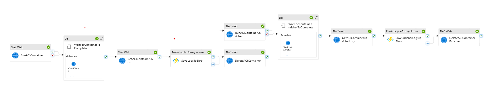

### BigData Podcast Analysis Pipeline




# 🔧 Setting GitHub Secrets from Local Machine

This guide describes how to configure GitHub secrets using local scripts.

## ✅ Prerequisites

Ensure the following tools are **installed and configured**:

* [GitHub CLI (`gh`)](https://cli.github.com/)
* [Azure CLI (`az`)](https://learn.microsoft.com/en-us/cli/azure/install-azure-cli)
* On **Windows**, run the scripts using **Git Bash** or a compatible shell environment.

---

## 📁 Environment Setup
Clone this repo to local machine and go to [local] directory.
Create and fill in .env file like shown in .example.env.

Run the `init.sh` script to set secrets and create service principal for azure.

---

## ☁️ Run Terraform Provisioning Scripts for Azure resources
Run scripts to set infrastructure with following order using GitBash.
These scripts trigger proper GitHub Workflows in the repo.
[NOTE] All scripts are indempotent and can be run repeteadly (gh workflow check and import resources before running terraform scripts)
```bash
# 1. Set resource group, OIDC for token based login, 
#    and storage with initial role assignments.
#    It also sets remote backend for the Terraform state in freshly spinned up azure storage
./provision.sh --env bootstrap 

# 2. Set rest of needed resources for BigData pipe:
./provision.sh --env main

# 3. build images and push them to spinned Azure Container Registry:
./provision.sh --env image_scraper
./provision.sh --env image_enricher
./provision.sh --env buildtest # [optional] for testing purposes
#./provision.sh --env image_whisperer

# 4. deploy Azure Function for saving logs of ephemeral Azure Contianer Instances to storage
./provision.sh --env azfnlogs

# 5. deploy Azure Data Factory as an Orchestrator of BigData Pipeline for Podcasts Analysis
./provision.sh --env adf
./provision.sh --env pipetest # [optional] test pipeline for debuging

## Bonus scripts
./provision.sh --env cleanacr # Remove all images from ACR besides last pushed for each repository

```

## ☁️ Local development and testing:
[./development.sh] in repo root directory serves as entrypoint for running individual services of this pipe locally:

[Local-S3-compatibile-storage]

   > Run SeaweedFS with local S3 Storage

[Docker-images-builds]
   > Build image - PCaster - podcast rankings scraper

   > Build image - Enricher - podcast metadata enricher

   > Build image - Whisperer - scalable audio transcriber

[Run-pipe-bricks]
   > Run PCaster with local S3 - Pipeline Stage 1 (Ingest) - Apple Podcasts, Apple Platform, US Region

   > Run PCaster with local S3 - Pipeline Stage 1 (Ingest) - Full Range

   > Run Enricher with local S3 - Pipeline Stage 2 (Process) - Enrich metadata for podcasts & generate batch_job.json for Whisperer

[Transcription-cluster]
   > Run Whisperer cluster with local S3 baked in and Azure defined connection - Pipeline Stage 3 (Process) - listening for job submissions

   > Run Whisperer Batch Job - Pipeline Stage 4 (Process) - run Whisperer batch job generated by Enricher